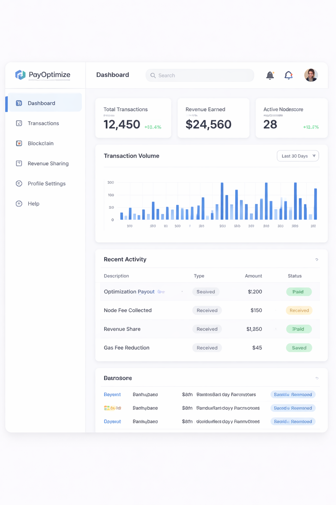
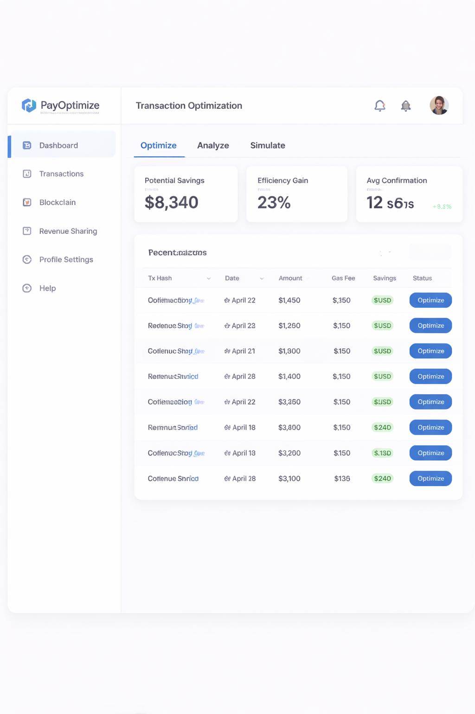
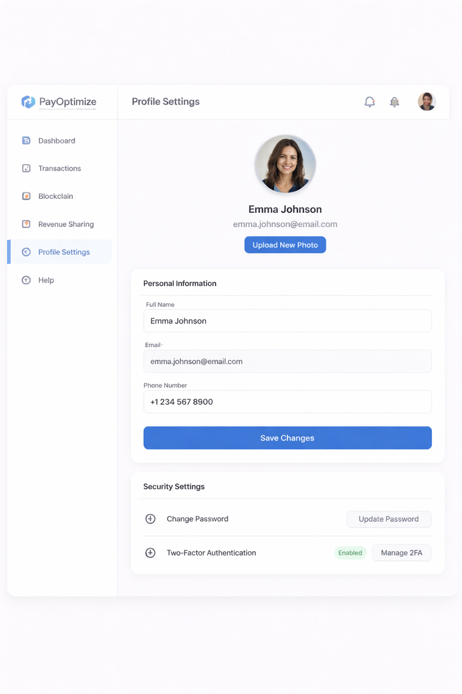
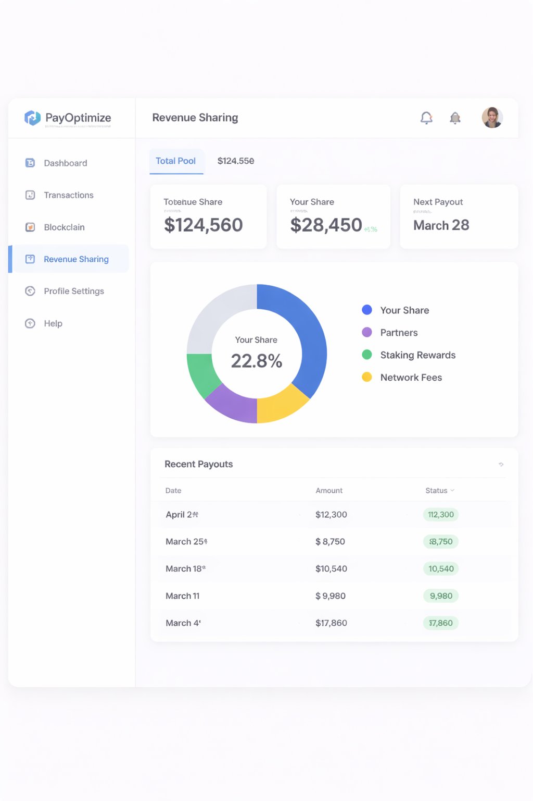
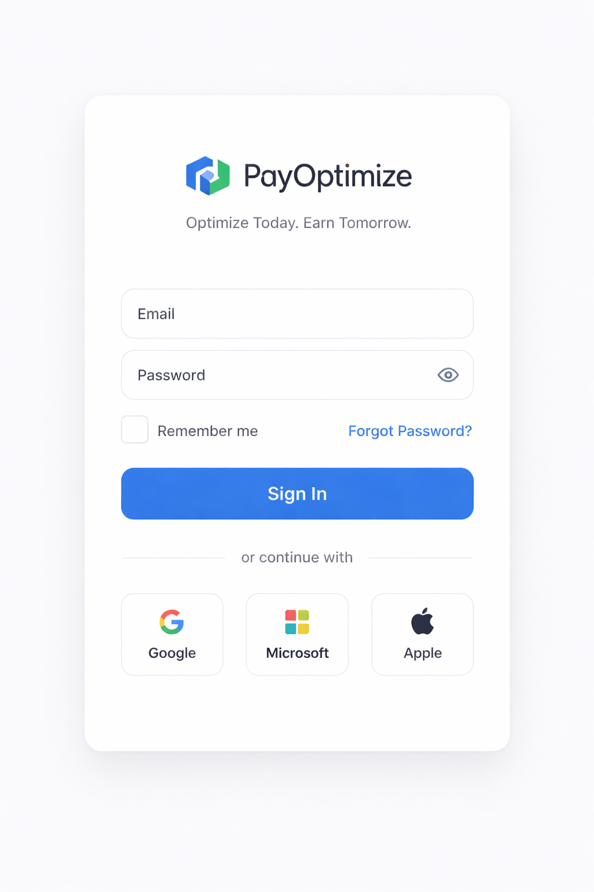

<div align="center">


# ⛓ SmartChain Hub

### The First Sovereign AI Agent Economy on 0G

[](https://smartchainhubfrontend.vercel.app)
[](https://scan-testnet.0g.ai)
[](https://0g.ai)
[](LICENSE)

> **0G APAC Hackathon 2026 — Track 3: Agentic Economy & Autonomous Applications**

*"Every optimization generates 4 verifiable on-chain actions. Every interaction makes the agent smarter. Every agent earns revenue autonomously."*

</div>

---

## 🧠 What Is SmartChain Hub?

SmartChain Hub is not a chatbot with a wallet.

It is a **new economic primitive** — a fully autonomous AI agent economy where every user owns a sovereign AI agent with:

- 🪪 **On-chain identity** — a soulbound NFT that cannot be copied, transferred, or revoked
- 🧠 **Persistent cross-device memory** — stored on 0G Storage KV, survives device resets
- 🔬 **Verifiable intelligence** — TEE-attested inference via 0G Compute TeeML
- 💰 **Autonomous revenue** — agents earn, stake, and pay each other without human intermediaries
- 📈 **Self-improving models** — fine-tuned on real user transaction data from 0G Storage

Every agent is a **first-class economic actor** on 0G Chain.

---

## 🔗 Live Contracts — 0G Galileo Testnet

| Contract | Address | Explorer |
|---|---|---|
| 🤖 SmartChainAgentID | `0x69C619374c6B901b99941Df7238fceb80d7DCd08` | [ChainScan ↗](https://scan-testnet.0g.ai/address/0x69C619374c6B901b99941Df7238fceb80d7DCd08) |
| 🔒 SmartChainAgentEscrow | `0x0A3951414c4097AF78953a97e49ad38293e9eA17` | [ChainScan ↗](https://scan-testnet.0g.ai/address/0x0A3951414c4097AF78953a97e49ad38293e9eA17) |
| 💸 SmartChainPayments | `0x540aFf6B167F8B5889d852d124C545F5f876A7eB` | [ChainScan ↗](https://scan-testnet.0g.ai/address/0x540aFf6B167F8B5889d852d124C545F5f876A7eB) |
| 📊 SmartChainRevenue | `0x8858886AEE6342DFA4DE5Cf66dB25dCF75b31A08` | [ChainScan ↗](https://scan-testnet.0g.ai/address/0x8858886AEE6342DFA4DE5Cf66dB25dCF75b31A08) |
| 📝 SmartChainTransaction | `0xf95A1610be22046c334E3bD1b11D2B88519E6C52` | [ChainScan ↗](https://scan-testnet.0g.ai/address/0xf95A1610be22046c334E3bD1b11D2B88519E6C52) |

**Network:** 0G Galileo Testnet · Chain ID `16602` · RPC `https://evmrpc-testnet.0g.ai`

---

## 🏗️ System Architecture

```
╔══════════════════════════════════════════════════════════════════════╗
║                    USER BROWSER  ·  Next.js 16 + React 19           ║
║                                                                      ║
║   [ Login ] → [ Dashboard ] → [ Agent ID Card ] → [ Optimizer ]     ║
║   [ ZK Badge ] · [ TEE Badge ] · [ Escrow UI ] · [ Fine-tune ]      ║
╚══════════════════════════╦═══════════════════════════════════════════╝
                           ║  REST / JSON
╔══════════════════════════╩═══════════════════════════════════════════╗
║              BACKEND API  ·  Node.js / Express                      ║
║                                                                      ║
║   POST /api/transactions/process   → optimize + store + record      ║
║   POST /api/transactions/fine-tune → fetch 0G roots → train         ║
╚══════════╦═══════════════════════════════════════════════════════════╝
           ║
     ╔═════╩══════════════════════════════════════════╗
     ║                                               ║
╔════╩═════════════════╗   ╔═══════════════════════════════════════════╗
║  AI AGENT            ║   ║  0G STORAGE LAYER  ·  Next.js API Routes  ║
║  ─────────────────── ║   ║  ─────────────────────────────────────── ║
║  Model: LLaMA 3.1 8B ║   ║  POST /api/storage-upload  → Log layer   ║
║  Mode:  TeeML        ║   ║  GET/POST /api/agent-memory → KV layer   ║
║  POST /fine-tune     ║   ║  POST /api/zk-proof → ZK commitment      ║
║  TF 2.16 fallback    ║   ║  Returns Merkle root hash                ║
╚══════════════════════╝   ╚═══════════════════════╦═══════════════════╝
                                                   ║ rootHash committed
                           ╔═══════════════════════╩═══════════════════╗
                           ║  0G CHAIN  ·  5 Smart Contracts           ║
                           ║  ─────────────────────────────────────── ║
                           ║  SmartChainAgentID   → soulbound NFT      ║
                           ║    .mintAgentID()    → one per wallet     ║
                           ║    .updateMemory()   → KV root on-chain   ║
                           ║    .reputation       → increments/tx      ║
                           ║                                           ║
                           ║  SmartChainAgentEscrow → micropayments    ║
                           ║    .deposit()        → fund channel       ║
                           ║    .payPerCall()     → claim per API      ║
                           ║    .withdraw()       → reclaim balance    ║
                           ║                                           ║
                           ║  SmartChainTransaction → record tx        ║
                           ║  SmartChainRevenue     → auto payout      ║
                           ║  SmartChainPayments    → stake / earn     ║
                           ╚═══════════════════════════════════════════╝
```

---

## ♻️ The Economic Flywheel

Every single optimization triggers a self-reinforcing loop across the entire 0G stack:

```
  ┌─────────────────────────────────────────────────────────────────┐
  │                                                                 │
  │   User submits transaction                                      │
  │          │                                                      │
  │          ▼                                                      │
  │   🤖  AI Agent (0G Compute TeeML)                              │
  │          │  LLaMA 3.1 8B returns optimized route + TEE proof   │
  │          ▼                                                      │
  │   🔐  ZK Proof generated (Groth16 / SHA-256 commitment)        │
  │          │  proves: savings > 0, fee < 2%, rate ∈ [0.001,0.04] │
  │          ▼                                                      │
  │   📦  Receipt → 0G Storage Log                                 │
  │          │  Merkle root returned + stored in Supabase           │
  │          ▼                                                      │
  │   🪪  Agent ID updated on-chain                                │
  │          │  reputation++, memoryRoot = new KV root              │
  │          ▼                                                      │
  │   💰  0.5% fee collected                                       │
  │          │  distributed to stakers via SmartChainPayments       │
  │          ▼                                                      │
  │   📈  Revenue share recorded                                   │
  │          │  claimable via SmartChainRevenue                     │
  │          ▼                                                      │
  │   🔄  User claims → stakes back → earns 5% APY                │
  │          │                                                      │
  │          ▼                                                      │
  │   🧬  Storage roots accumulate                                 │
  │          │  Fine-tune TF model on real user data (≥10 samples)  │
  │          │                                                      │
  │          └──────────────────────────────────────────────────┐  │
  │                                                             │  │
  │   Model improves → better routes → more savings → more use  │  │
  │                                                             ▼  │
  └─────────────────────────────────────────────────────────────┘  │
                              ▲                                     │
                              └─────────────────────────────────────┘
```

**4 verifiable on-chain actions per user interaction:**
`1 Storage upload` + `1 ZK proof` + `1 Agent ID update` + `1 revenue event`

---

## 🧩 Full 0G Stack Integration

| 0G Component | How We Use It | Proof |
|---|---|---|
| **0G Compute TeeML** | LLaMA 3.1 8B inference via broker SDK — TEE-attested optimization | `X-TEE-Proof` header in response; `tee_verified: true` in API |
| **0G Compute Fine-tuning** | `POST /fine-tune` fetches real tx receipts by root hash, converts to 6-feature vectors, incrementally trains TF model at `lr=0.0001` | Model hash updated on-chain after each run |
| **0G Storage Log** | Immutable transaction receipts via `@0glabs/0g-ts-sdk` MemData upload | Merkle root stored in Supabase + committed on-chain |
| **0G Storage KV** | Agent memory persisted cross-session — versioned writes prevent stale overwrites; `hydrateAgentMemory()` syncs on mount | Memory root committed to AgentID contract |
| **0G Chain** | 5 contracts on Galileo Testnet — settlement, revenue, identity, escrow, payments | All addresses verified on ChainScan |
| **Agent ID Standard** | `SmartChainAgentID.sol` — soulbound NFT storing `modelHash` + `memoryRoot` + `reputation` | Non-transferable; updated on every optimization |
| **Agent Escrow** | `SmartChainAgentEscrow.sol` — `deposit → payPerCall → withdraw`; 1% platform fee | Full UI in Payments → Agent Escrow tab |
| **ZK Proofs** | Groth16 via snarkjs (when circuit files present) or SHA-256 commitment fallback | Commitment stored in every 0G Storage receipt; purple badge in UI |

---

## 🆚 Why SmartChain Hub Wins Track 3

| Capability | Traditional AI Apps | SmartChain Hub |
|---|---|---|
| Agent identity | API key — copyable, revocable | Soulbound NFT on 0G Chain — permanent, non-transferable |
| Agent memory | Session-only / centralized DB | 0G Storage KV — versioned, cross-device, survives resets |
| Inference proof | None | TEE-verified via 0G Compute TeeML |
| Agent receipts | Centralized logs | Immutable 0G Storage Log + Merkle root |
| Revenue model | Platform takes all | Automated on-chain distribution via SmartChainRevenue |
| Agent payments | None | Per-API-call micropayments via SmartChainAgentEscrow |
| Model improvement | Static, manual retraining | Fine-tuned on real user data from 0G Storage |
| Proof of work | None | ZK commitment (SHA-256 / Groth16) stored on-chain |

---

## 🛠️ Tech Stack

### ⛓ Blockchain & Smart Contracts


-000000?style=flat-square&logo=rust)

- 5 production contracts on 0G Galileo Testnet (Chain ID `16602`)
- `SmartChainAgentID` — soulbound NFT with `memoryRoot`, `modelHash`, `reputation`
- `SmartChainAgentEscrow` — agent-to-agent micropayment channels with 1% platform fee
- `SmartChainRevenue` — proportional revenue distribution to stakers (10% fee share)
- `SmartChainPayments` — send/stake/withdraw with 5% APY and 0.5% fee
- `SmartChainTransaction` — immutable on-chain transaction records
- Rust WASM optimizer module for high-performance route calculation

### 🤖 AI Agent


- Flask server with lazy-loaded TensorFlow (avoids OOM on Render free tier)
- 6-feature neural network: `amount_norm`, `priority_one_hot[3]`, `congestion`, `time_of_day`
- 3 output heads: `savings_rate`, `confidence`, `risk_score`
- 0G Compute TeeML broker integration — falls back to local TF model gracefully
- Incremental fine-tuning on real user data fetched from 0G Storage by Merkle root hash
- 9 test suites: unit, integration, e2e, performance, security, functional, exploratory

### 🌐 Frontend


- 15 pages: dashboard, transactions, revenue, payments, profile, history, console, docs, blog, onramp, and more
- `AgentIDCard` — live soulbound identity display with TEE/ZK badges
- `AIDecisionTree` + `AIDecisionFeed` — real-time optimization visualization
- `OptimizationAnalytics` — savings charts and performance metrics
- `RevenueSharingWidget` — live staking and earnings UI
- MetaMask SDK integration with Web3Context
- Stripe + Flutterwave M-Pesa on-ramp

### 🗄️ Storage & Database


- `@0glabs/0g-ts-sdk` — MemData upload to 0G Storage Log layer
- 0G Storage KV — versioned agent memory with `hydrateAgentMemory()` cross-device sync
- Supabase — relational transaction history + Merkle root index
- snarkjs — Groth16 ZK proofs with SHA-256 commitment fallback

### 🔧 Backend


- Express API with security middleware
- AI service proxy with error handling and fallback logic
- Blockchain service for smart contract interactions
- Multi-platform deployment: Render, Railway, Fly.io

---

## 🌐 Languages


```
  TypeScript   ████████████████████████████████░░░░░░░░░░░░░░░░   64.4%
  Python       ████████████░░░░░░░░░░░░░░░░░░░░░░░░░░░░░░░░░░░░   18.3%
  JavaScript   █████░░░░░░░░░░░░░░░░░░░░░░░░░░░░░░░░░░░░░░░░░░░    8.4%
  Shell        ███░░░░░░░░░░░░░░░░░░░░░░░░░░░░░░░░░░░░░░░░░░░░░░    4.6%
  Solidity     ██░░░░░░░░░░░░░░░░░░░░░░░░░░░░░░░░░░░░░░░░░░░░░░░    3.8%
  Rust         ░░░░░░░░░░░░░░░░░░░░░░░░░░░░░░░░░░░░░░░░░░░░░░░░░    0.3%
  Other        ░░░░░░░░░░░░░░░░░░░░░░░░░░░░░░░░░░░░░░░░░░░░░░░░░    0.2%
```

---

## 📁 Project Structure

```
SmartChain-Hub/
│
├── 🤖 ai-agent/
│   ├── server/
│   │   └── app.py                  # Flask + 0G Compute broker + TF fallback
│   ├── scripts/
│   │   ├── optimizer.py            # TransactionOptimizer (3 routes)
│   │   └── fine_tuner.py           # Incremental TF fine-tuning on 0G Storage data
│   ├── models/
│   │   └── savings_model.py        # 6-feature TensorFlow neural network
│   └── tests/                      # 9 test suites (unit → e2e → security)
│
├── ⛓ blockchain/
│   ├── contracts/
│   │   ├── SmartChainAgentID.sol   # Soulbound NFT — identity + memory + reputation
│   │   ├── SmartChainAgentEscrow.sol # Agent-to-agent micropayment channels
│   │   ├── SmartChainRevenue.sol   # Proportional revenue distribution
│   │   ├── SmartChainPayments.sol  # Send / stake / withdraw + 5% APY
│   │   └── SmartChainTransaction.sol # Immutable transaction records
│   ├── rust-optimizer/             # Rust WASM route optimizer
│   └── scripts/                    # Hardhat deploy scripts
│
├── 🌐 smartchain_hub_frontend/
│   └── src/
│       ├── pages/
│       │   ├── dashboard.tsx       # Agent ID card + live stats
│       │   ├── transactions.tsx    # AI optimizer + confirm flow
│       │   ├── revenue.tsx         # Revenue sharing + claim
│       │   ├── payments.tsx        # Send / stake / Agent Escrow
│       │   └── api/
│       │       ├── storage-upload.ts  # 0G Storage Log upload
│       │       ├── agent-memory.ts    # 0G KV read/write
│       │       └── zk-proof.ts        # Groth16 / SHA-256 proof
│       ├── components/
│       │   ├── AgentIDCard.tsx     # Soulbound identity display
│       │   ├── AIDecisionTree.tsx  # Optimization visualization
│       │   └── RevenueSharingWidget.tsx
│       └── utils/
│           ├── agentMemory.ts      # KV + localStorage dual-write
│           ├── agentId.ts          # Agent ID contract interactions
│           ├── zkProof.ts          # ZK proof client
│           └── storage.ts          # 0G Storage client wrapper
│
├── 🔧 smartchain_hub_backend/
│   ├── controllers/
│   │   └── transactionController.js # 0G Storage integration
│   └── services/
│       ├── aiService.js            # AI agent proxy
│       └── blockchainService.js    # Contract interactions
│
└── 📚 docs/
    ├── mockups/                    # UI wireframes and mockups
    ├── demo/                       # Pitch deck + video scripts
    └── backend/                    # Supabase migrations (001–006)
```

---

## 🚀 Quick Start

### Prerequisites

- Node.js 20+, Python 3.12+
- Funded 0G Galileo wallet → [Get tokens ↗](https://hub.0g.ai/faucet)

### 1. Clone & Install

```bash
git clone <repo>
cd SmartChain-Hub

# Frontend
cd smartchain_hub_frontend
cp .env.local.example .env.local   # fill in keys — see Environment Variables section
npm install && npm run dev          # → http://localhost:3000

# AI Agent
cd ../ai-agent
cp .env.example .env               # fill in OG_COMPUTE_PRIVATE_KEY
pip install -r requirements.txt
python3 server/app.py              # → http://localhost:5000
```

### 2. Supabase Setup

Run migrations in order in your Supabase SQL editor:

```
docs/backend/supabase_schema.sql
docs/backend/supabase_migration_001.sql
docs/backend/supabase_migration_002.sql
docs/backend/supabase_migration_003.sql
docs/backend/supabase_migration_004.sql
docs/backend/supabase_migration_005.sql
docs/backend/supabase_migration_006.sql
```

### 3. Deploy Contracts

```bash
cd blockchain
cp .env.example .env               # set PRIVATE_KEY to funded wallet
npm install
npx hardhat run scripts/deploy.js --network og_newton
# Copy output addresses → update .env.local
```

### 4. Deploy AI Agent (Production)

```bash
# Option A — Render (recommended)
git push && connect repo to Render dashboard

# Option B — Railway
cd ai-agent && railway login && railway up
railway variables set OG_COMPUTE_PRIVATE_KEY=<key>

# Option C — Fly.io
cd ai-agent && fly launch && fly secrets set OG_COMPUTE_PRIVATE_KEY=<key> && fly deploy

# Option D — Automated
./deploy.sh
```

---

## 🔑 Environment Variables

```env
# ── Frontend (.env.local) ──────────────────────────────────────────
NEXT_PUBLIC_SUPABASE_URL=
NEXT_PUBLIC_SUPABASE_ANON_KEY=
NEXT_PUBLIC_CONTRACT_ADDRESS=        # SmartChainTransaction
NEXT_PUBLIC_PAYMENTS_CONTRACT=       # SmartChainPayments
NEXT_PUBLIC_AGENT_ID_CONTRACT=       # SmartChainAgentID
NEXT_PUBLIC_AGENT_ESCROW_CONTRACT=   # SmartChainAgentEscrow
NEXT_PUBLIC_REVENUE_CONTRACT=        # SmartChainRevenue
NEXT_PUBLIC_STORAGE_PRIVATE_KEY=     # 0G Storage wallet key (client)
STORAGE_PRIVATE_KEY=                 # 0G Storage wallet key (server)
NEXT_PUBLIC_AI_AGENT_URL=http://localhost:5000
NEXT_PUBLIC_CHAIN=og_newton

# ── AI Agent (.env) ────────────────────────────────────────────────
OG_COMPUTE_PRIVATE_KEY=              # Funded wallet for 0G Compute broker
OG_COMPUTE_RPC=https://evmrpc-testnet.0g.ai
OG_COMPUTE_BROKER_URL=https://broker.0g.ai
OG_COMPUTE_MODEL=llama-3.1-8b-instruct

# ── Blockchain (.env) ──────────────────────────────────────────────
PRIVATE_KEY=                         # Deployer wallet
```

---

## 🗺️ Roadmap

| Status | Feature | 0G Module |
|---|---|---|
| ✅ Live | Agent ID soulbound NFT + memory root on-chain | 0G Chain |
| ✅ Live | TEE-verified inference via 0G Compute TeeML | 0G Compute |
| ✅ Live | Immutable receipts on 0G Storage Log layer | 0G Storage |
| ✅ Live | Agent memory — 0G Storage KV, versioned, cross-device | 0G Storage KV |
| ✅ Live | Fine-tune TF model on real user tx data from 0G Storage | 0G Compute |
| ✅ Live | Agent-to-Agent micropayments — SmartChainAgentEscrow | 0G Chain |
| ✅ Live | ZK-verified transaction proofs — SHA-256 commitment | 0G Privacy |
| 🔜 Next | Full Groth16 ZK proofs — compile Circom circuit + proving keys | 0G Privacy |
| 🔜 Next | Fine-tune with production user data (≥10 real transactions) | 0G Compute |
| 🔜 Next | Official 0G Persistent Memory module integration | 0G Persistent Memory |
| 🔜 Next | Multi-agent coordination — agents hiring agents | 0G Chain |

---

## 🧪 Testing

```bash
# AI Agent — 9 test suites
cd ai-agent
pytest tests/test_unit.py tests/test_integration.py tests/test_e2e.py
pytest tests/test_security.py tests/test_performance.py

# Frontend
cd smartchain_hub_frontend
npm test                  # Jest + React Testing Library
npm run test:coverage

# Smart Contracts
cd blockchain
npx hardhat test
```

---

## 📸 Screenshots

| Dashboard | Transaction Optimizer | Agent ID Card |
|---|---|---|
|  |  |  |

| Revenue Dashboard | Payments | Full App |
|---|---|---|
|  |  |  |

---

## 🏆 Hackathon Submission

- **Track:** Track 3 — Agentic Economy & Autonomous Applications
- **Event:** 0G APAC Hackathon 2026
- **Live Demo:** https://smartchainhubfrontend.vercel.app
- **Contracts:** Verified on [0G ChainScan](https://scan-testnet.0g.ai)
- **Pitch Deck:** [docs/demo/SmartChain_Hub_Pitch_Deck.md](docs/demo/SmartChain_Hub_Pitch_Deck.md)
- **Submission Checklist:** [docs/submission/SUBMISSION_CHECKLIST.md](docs/submission/SUBMISSION_CHECKLIST.md)

---

<div align="center">

Built with ❤️ for the 0G APAC Hackathon 2026

`#0GHackathon` · `#BuildOn0G` · `#AgenticEconomy`

**[🌐 Live Demo](https://smartchainhubfrontend.vercel.app)** · **[📊 ChainScan](https://scan-testnet.0g.ai/address/0x69C619374c6B901b99941Df7238fceb80d7DCd08)** · **[📚 Docs](docs/)**

⚖️ MIT License

</div>
